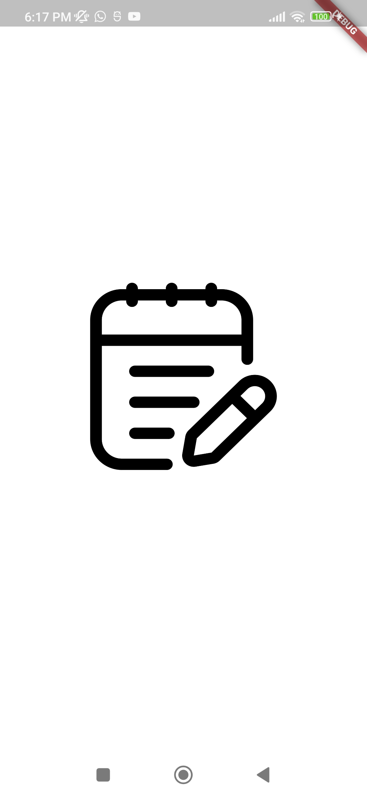
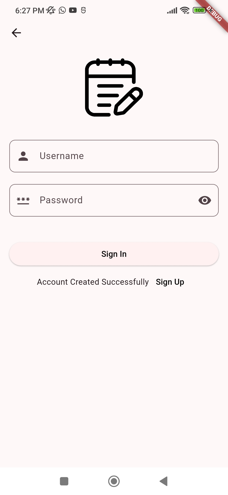
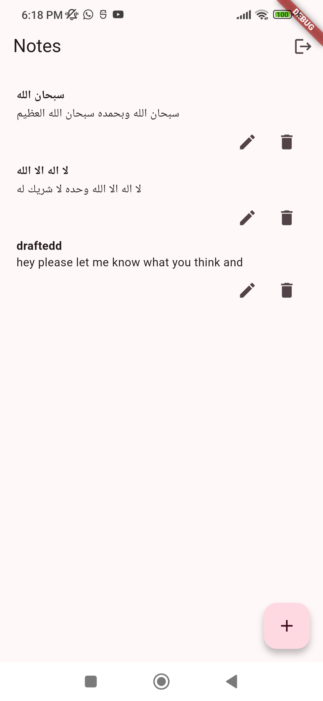
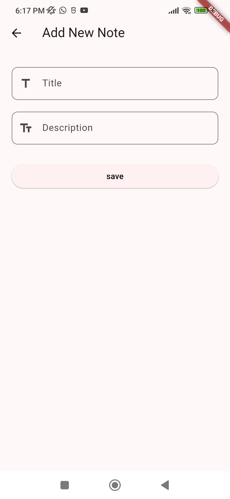
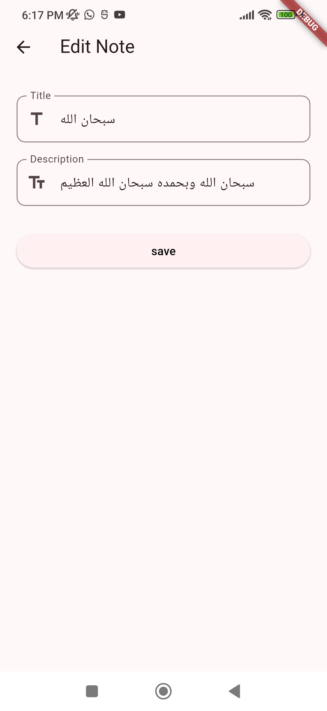
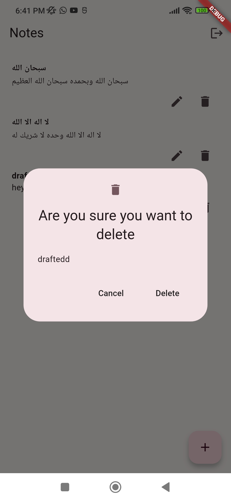
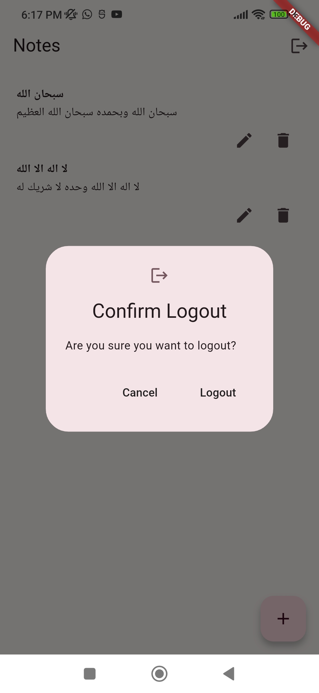

# Notes App

A simple local notes app built using Flutter and SQLite (`sqflite` package). This app allows users to create, read, update, and delete notes, with persistent storage via SQLite.

## Screenshots

### 🌱 Splash Screen

### 📝 Sign Up Screen

### 🔑 Sign In Screen

### 📑 All Notes Screen

### ➕ Add Note Screen

### ✏️ Edit Note Screen

### 🗑️ Delete Note

### 🚪 Logout

## Download APK

You can download the  APK for the Notes App from this link: [Download APK](https://github.com/hudaolayan/Notes/releases/download/AndroidApk/notes-app.apk)

